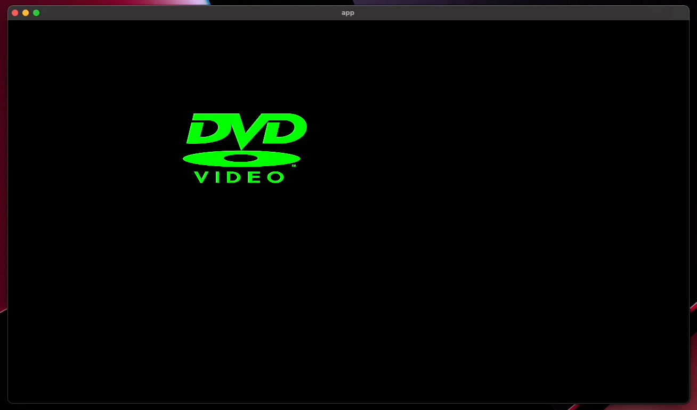

# 📺 Bevy bouncing DVD logo

This project is a simple demonstration of using the Bevy game engine and the Rust programming language to create a bouncing DVD logo animation.

## Prerequisites

In order to run this project, you will need to have the following software installed on your system:

- [Rust](https://www.rust-lang.org/): a programming language that is used to build this project.
- [Cargo](https://doc.rust-lang.org/cargo/): the package manager for Rust, which is used to manage dependencies and build the project.

## Running the Project

To run the project, follow these steps:

- Clone the repository to your local machine:

```
git clone https://github.com/ahkohd/bevy-rust-bouncing-dvd-logo.git
```

- Navigate to the project directory:

```
cd bevy-rust-bouncing-dvd-logo
```

- Build and run the project using Cargo:

```
cargo run
```

This will compile the project and launch the DVD logo animation in a window.



## Contributing

If you would like to contribute to this project, please fork the repository and submit a pull request with your changes. We welcome contributions of all kinds, including bug fixes, documentation improvements, and new features.

## License

This project is licensed under the MIT License. See the [LICENSE](./LICENSE.md) file for details.
